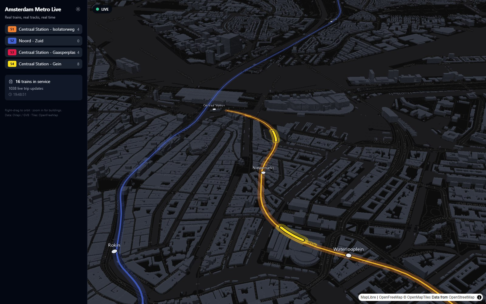

# 🚇 Amsterdam Metro Live

> **A live, 3D, orbitable map of Amsterdam's GVB metro — real trains, riding real track geometry, in real time.**



Built in the spirit of [londonunderground.live](https://www.londonunderground.live/) 🇬🇧 — but for Amsterdam 🇳🇱, and with your choice of dark 🌙 or light ☀️ mode.

---

## ✨ What it does

- 🚈 **Live trains** for all active GVB metro lines (50–54), positioned every few seconds from real GTFS-realtime data
- 🛤️ **Real track geometry** — trains ride the actual curves of the rails, not straight lines between stations
- 🏙️ **3D buildings** rendered from vector tiles, with an orbitable, pitchable camera (right-drag to spin around the city)
- ⏱️ **Live delays** — see which trains are running late, straight from the same feed GVB itself uses
- 🚉 **Click a station** for a live departure board — next 8 trains, headsign, and countdown
- 🎯 **Click a train** to follow it with the camera as it moves through the city
- 💫 **Fading motion trails** behind every train, so movement reads at a glance
- 🌗 **Dark / light theme switch**, remembered across visits
- 🎬 Opens with a cinematic fly-in, landing right on the busiest, most building-dense part of the network

## 🧠 How it works

Amsterdam's metro fleet — like London's — publishes **no GPS positions**. So instead of tracking trains directly, this app derives their position the same way [londonunderground.live](https://www.londonunderground.live/) does for the Underground:

1. 📦 **GTFS static** (daily, from [OVapi](https://gtfs.ovapi.nl/nl/)) gives us the metro routes, stations, timetables, and true track shapes
2. 📡 **GTFS-realtime `tripUpdates.pb`** (polled every ~30s) gives live per-station arrival/departure predictions for every active trip
3. 🧮 A **position solver** places each train along its track shape between its last departed and next predicted station — smooth, believable, live movement

## 🛠️ Stack

| Layer | Tech |
|---|---|
| Backend | 🐍 FastAPI (Python) — GTFS ingest, realtime poller, position solver |
| Frontend | ⚛️ React + TypeScript + Vite |
| Map & 3D | 🗺️ MapLibre + deck.gl (`MapboxOverlay`, `PathLayer`, `TripsLayer`) |
| Data | 🚏 OVapi / openOV (free, fair use) |
| Tiles | 🌍 OpenFreeMap (dark & light styles) |

## 🚀 Run it locally

```bash
# Backend (Python 3.12+)
cd backend
python -m venv .venv && .venv/Scripts/pip install -r requirements.txt
.venv/Scripts/python -m uvicorn app.main:app --port 8020

# Frontend
cd frontend
npm install
npm run dev   # → http://localhost:5183 (proxies /api to :8020)
```

**Production preview locally** (optional):

```bash
cd frontend
cp .env.production.example .env.production.local
# edit VITE_API_URL if your backend runs elsewhere
npm run build && npm run preview
```

Deploy to Render: see [docs/render-deploy-plan.md](docs/render-deploy-plan.md).  
Costs & specs: see [docs/costs-and-specs.md](docs/costs-and-specs.md).

First backend start downloads the national GTFS zip (~240MB, cached) and extracts the GVB metro subset — a few MB, refreshed daily.

## 💸 Running costs

No API keys, no paid services required:

| Item | Cost |
|---|---|
| Transit data (OVapi / NDOV) | Free |
| Map tiles (OpenFreeMap) | Free |
| Small VPS to host backend + frontend | ~€5–10/month |

Full breakdown (RAM, bandwidth, Render tiers): **[docs/costs-and-specs.md](docs/costs-and-specs.md)**.

## 🙏 Credits

- 🚇 Data: [OVapi](https://gtfs.ovapi.nl/) / [openOV](https://openov.nl/) / GVB
- 🗺️ Tiles: [OpenFreeMap](https://openfreemap.org/) & OpenStreetMap contributors
- 💡 Inspiration: [londonunderground.live](https://www.londonunderground.live/) by Ben James

## 📄 License

MIT — see [LICENSE](LICENSE).
